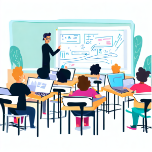

<table class="tablenborders">
    <tbody class="body" >
      <tr>
        <td width="200px">
            
        </td>
        <td>
            <h3><b>Demonstrações</b></h3>
            Sessões online onde são apresentadas demonstrações de soluções desenvolvidas com Power Platform.
        </td>
      </tr>
    </tbody>
    </table>

#### **Sessões**

<table class="tablewborders">
<tbody align="center">
  <tr>
    <td>Teste</td>
    <td>Teste</td>
    <td>Teste</td>
  </tr>
  <tr>
    <td width="33%"><a href="../events/demos/appdev/">Desenvolvimento de Aplicativos e Portais com Power Platform</a></td>
    <td width="34%"><a href="../events/demos/hyperautomation/">Hiper automação com Power Platform</a></td>
    <td width="33%"><a href="../events/demos/govalm/">Governança e ALM na Power Platform</a></td>
  </tr>
</tbody>
</table>

<table class="tablenborders">
    <tbody class="body" >
      <tr>
        <td width="200px">
            
        </td>
        <td>
            <h3><b>Workshops</b></h3>
            Sessões presenciais onde são apresentadas demonstrações de soluções desenvolvidas com Power Platform.
        </td>
      </tr>
    </tbody>
    </table>

#### **Sessões**

<table class="tablewborders" >
    <tbody align="center">
      <tr>
        <td>Teste</td>
        <td>Teste</td>
      </tr>
      <tr>
        <td width="50%"><a href="../">Power App in a Day</a></td>
        <td width="50%"><a href="../">Power Automate in a Day</a></td>
      </tr>
    </tbody>
    </table>